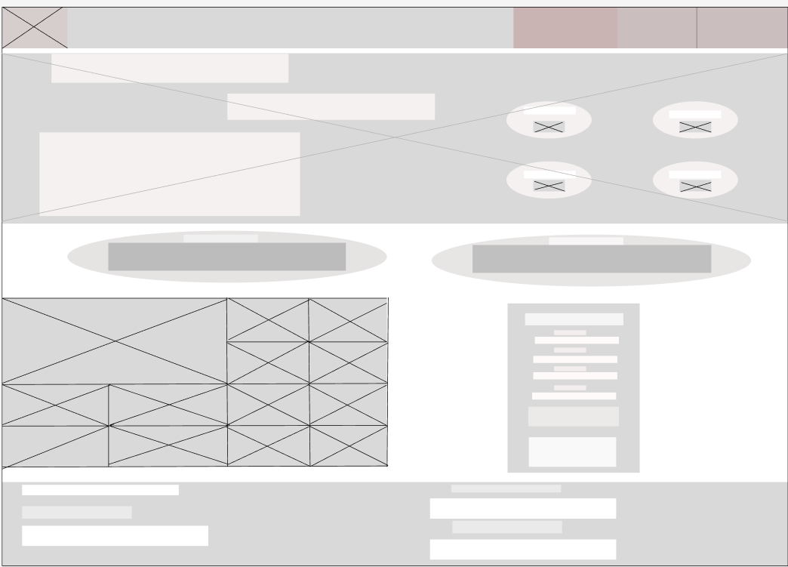
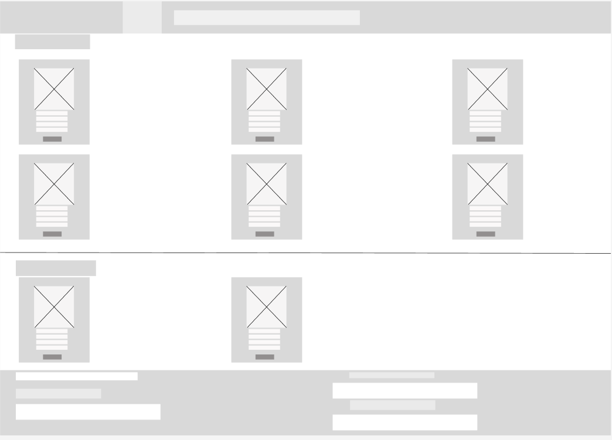
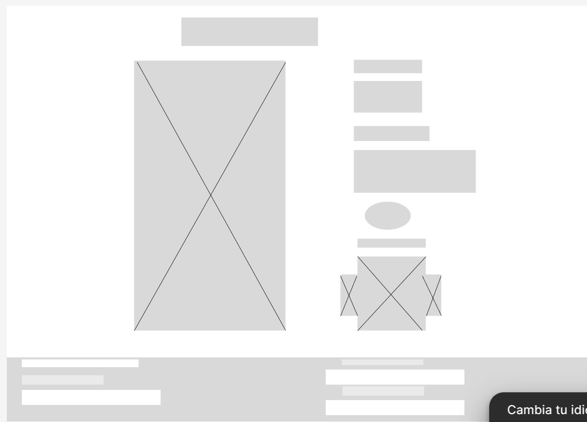

# 🌎 Web Patitas Felices
---
 Web para la Fundación Patitas Felices creado a base de html:5 y decorado con CSS.Trae elementos clave como un menu de navegación (nav), un carrusel de desvanecimieto acompañado de botones totalmene funcionalesy una descripcion de la empresa y su slogan. Trae la Vision y Mision de la fundación. Un collage con animaciones (:hover) acompañado de un formulario con informacion pedida de forma especifica (Nombres, Apellidos, Ciudad, Email y el mensaje) junto con unos botones los cuales solo se puede seleccionar uno de ellos y son el motivo de enviar el formulario (Adoptar, Donar, Voluntariado, Informacion)
# 🔗 Tecnologias
---
- HTML:5
- CSS
- Imagenes en carpetas en caso de perdida
---
# 📷 Vistas previas (Figma)
---
Enlace figma: https://www.figma.com/design/0zrOicvdLuN4ccdR6MG7t9/Sin-título?node-id=0-1&t=pcllWtrcSa7nxOZ3-1

### Primera Vista

### Segunda vista

### Tercera vista
